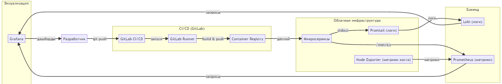

# DevOps Infrastructure Solution for Microservices Architecture

## Введение

Документ содержит предложения по организации инфраструктуры для разработки и эксплуатации микросервисной системы в облачной среде. Решения нацелены на масштабируемость, надёжность и удобство для разработчиков.

---

## Задача 1: Обеспечение разработки (CI/CD)

### Предлагаемое решение

**GitLab CI/CD + собственные раннеры**

Состав решения:
- GitLab (облачная версия или self-managed в облаке)
- GitLab Runner (агенты сборки на собственных серверах)
- GitLab Container Registry (хранилище Docker-образов)

### Соответствие требованиям

| Требование | Реализация |
|------------|------------|
| Облачная система | GitLab SaaS или self-managed в AWS / Яндекс.Облако |
| Система контроля версий Git | Встроенный Git-репозиторий |
| Репозиторий на каждый сервис | Отдельный проект в группе GitLab для каждого микросервиса |
| Запуск сборки по событию из Git | Триггеры на push, merge request, теги |
| Запуск сборки по кнопке с параметрами | Ручной запуск (when: manual) с передачей переменных |
| Привязка настроек к каждой сборке | Переменные CI/CD на уровне job, environment, проекта |
| Создание шаблонов конфигураций | Механизмы include и extends |
| Безопасное хранение секретов | Защищённые переменные CI/CD + интеграция с Vault |
| Несколько конфигураций из одного репозитория | Разные job-ы с правилами rules |
| Кастомные шаги при сборке | Произвольные скрипты в before_script, script, after_script |
| Собственные Docker-образы | Параметр image с указанием кастомного образа |
| Развёртывание агентов на своих серверах | GitLab Runner на собственных ВМ или в Kubernetes |
| Параллельный запуск нескольких сборок | Настройка concurrent в конфигурации runner |
| Параллельный запуск тестов | Механизм parallel: matrix |

### Принципы взаимодействия

1. Разработчик пушит код в GitLab
2. GitLab обнаруживает событие и запускает пайплайн, описанный в `.gitlab-ci.yml`
3. Пайплайн выполняется на выделенных раннерах, которые развёрнуты в облаке на серверах компании
4. Секретные данные подтягиваются из защищённых переменных или Vault
5. Готовый Docker-образ сохраняется в Container Registry
6. Результаты сборки и логи доступны в веб-интерфейсе GitLab

### Обоснование выбора

GitLab CI/CD выбран как единая платформа, объединяющая код, CI/CD, реестр контейнеров и управление секретами. Это исключает необходимость интеграции разнородных продуктов. Собственные раннеры на облачных серверах дают полный контроль над ресурсами и экономию бюджета. Вся конфигурация хранится в репозитории как код, что упрощает версионирование и аудит пайплайнов.

---

## Задача 2: Сбор и анализ логов

### Предлагаемое решение

**Loki + Promtail + Grafana**

Состав решения:
- Promtail — агент сбора логов на каждом хосте
- Loki — центральное хранилище логов
- Grafana — веб-интерфейс для поиска и анализа

### Соответствие требованиям

| Требование | Реализация |
|------------|------------|
| Сбор логов со всех хостов в центральное хранилище | Promtail на каждом хосте отправляет логи в Loki |
| Минимальные требования к приложениям | Достаточно писать логи в stdout/stderr |
| Гарантированная доставка до центрального хранилища | Встроенные механизмы retry и буферизации в Promtail и Loki |
| Поиск и фильтрация по записям логов | Язык запросов LogQL |
| Пользовательский интерфейс для разработчиков | Grafana с режимом Explore |
| Ссылка на сохранённый поиск | Grafana генерирует URL с параметрами запроса |

### Принципы взаимодействия

1. Приложения пишут логи только в stdout/stderr (стандарт 12-factor)
2. Контейнерная среда или systemd направляет эти логи в стандартные журналы хоста
3. Promtail на каждом хосте читает логи из файлов или сокетов
4. Promtail отправляет логи в Loki с метаданными (хост, сервис, namespace)
5. Loki индексирует и хранит логи в объектном хранилище
6. Разработчик заходит в Grafana, выбирает режим Explore
7. Пишет запрос на LogQL и получает отфильтрованные логи
8. Сохраняет ссылку на поиск для отправки коллегам или в тикет

### Обоснование выбора

Loki выбран из-за экономичности — он значительно дешевле ELK-стека при больших объёмах логов. Приложения не требуют изменений для работы с системой логирования. Интеграция с Grafana позволяет разработчикам использовать единый интерфейс и для логов, и для метрик мониторинга. Механизмы гарантированной доставки исключают потерю критических логов при временных сбоях.

---

## Задача 3: Мониторинг хостов и сервисов

### Предлагаемое решение

**Prometheus + Node Exporter + Grafana** (упрощённая конфигурация)

Состав решения:
- Node Exporter — сбор метрик хоста (CPU, RAM, HDD, Network)
- Prometheus — сбор, хранение и обработка метрик
- Grafana — визуализация и дашборды

### Соответствие требованиям

| Требование | Реализация |
|------------|------------|
| Сбор метрик со всех хостов | Node Exporter запущен на каждом хосте |
| Метрики ресурсов хоста (CPU, RAM, HDD, Network) | Предоставляются Node Exporter |
| Метрики потребления ресурсов каждого сервиса | Сервис сам отдаёт метрики по эндпоинту /metrics |
| Специфичные метрики для каждого сервиса | Приложение добавляет кастомные счётчики и датчики |
| UI с запросами и агрегацией | Grafana Explore + язык PromQL |
| UI с настройкой панелей | Grafana Dashboards с drag-and-drop редактором |

### Принципы взаимодействия

1. На каждом хосте запущен Node Exporter, собирающий метрики ОС
2. Каждый сервис имеет HTTP-эндпоинт `/metrics` (стандарт Prometheus)
3. Prometheus периодически опрашивает все Node Exporters и все сервисы
4. Метрики сохраняются в временной базе данных Prometheus
5. Разработчик заходит в Grafana для просмотра дашбордов
6. При необходимости использует PromQL для ad-hoc запросов
7. Настраивает собственные панели и сохраняет их

### Обоснование выбора

Prometheus является стандартом де-факто для мониторинга микросервисных систем. Node Exporter даёт полную картину по хостам. Самый простой способ получения метрик сервисов — добавление эндпоинта `/metrics` в само приложение, что не требует дополнительных агентов. Grafana обеспечивает удобную визуализацию и поддержку множества источников данных. Упрощённая конфигурация без cAdvisor снижает количество компонентов без потери функциональности.

---
## 
[Схема](block_arhitecture.mermaid)
